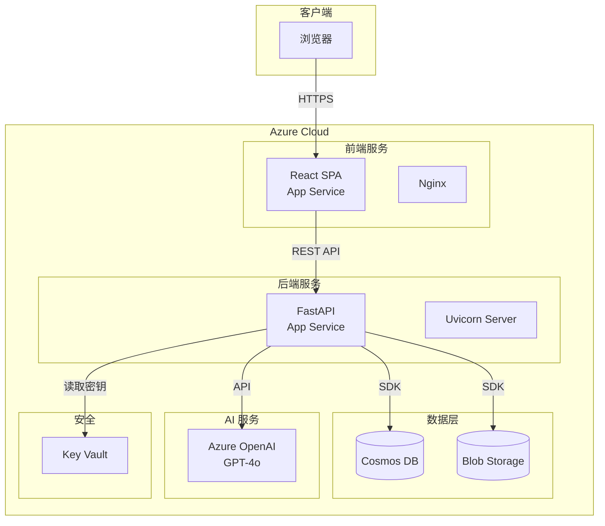
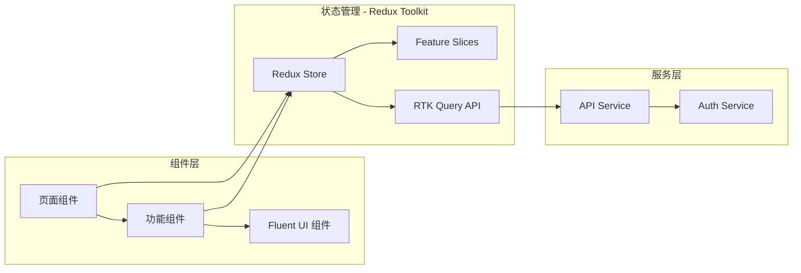
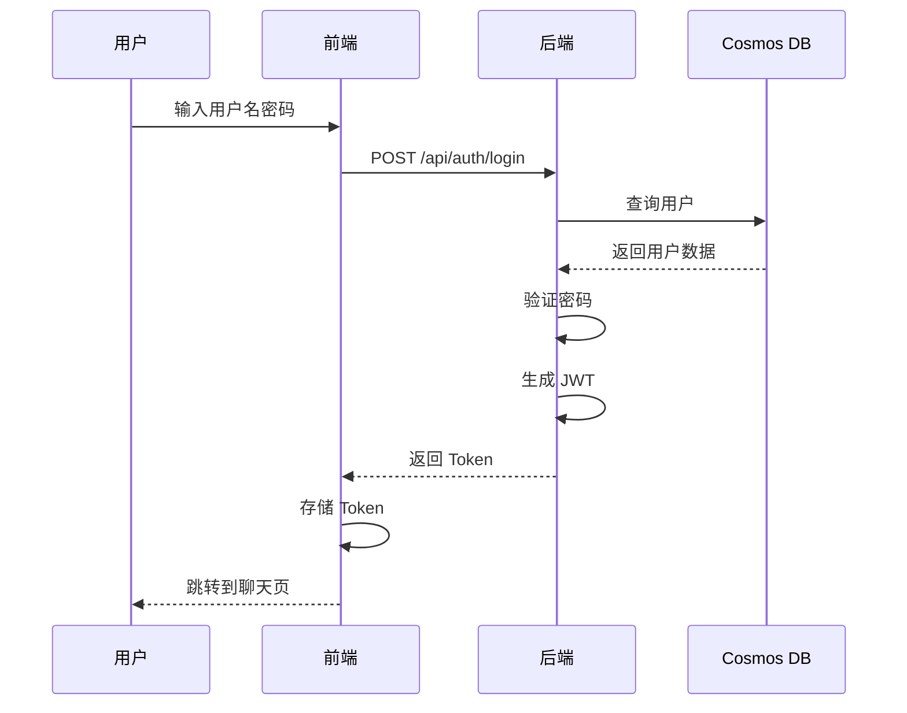
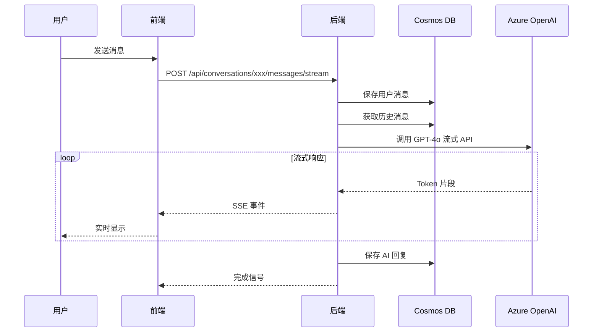
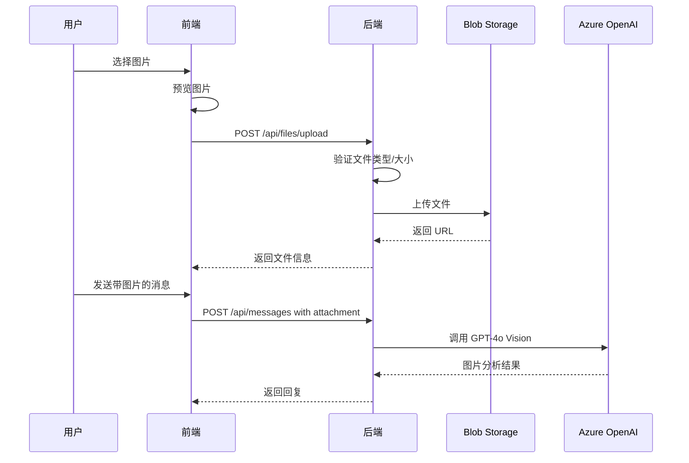
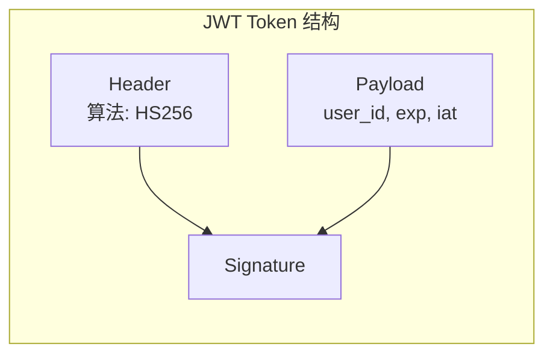
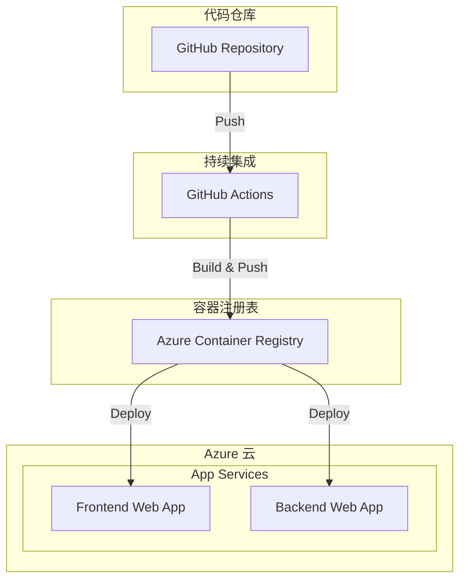

# AI Chat 系统架构设计

## 整体架构图



## 前端架构



### 前端技术选型

| 类别 | 技术 | 版本 | 说明 |
|------|------|------|------|
| 框架 | React | 18.x | 用户界面库 |
| 语言 | TypeScript | 5.x | 类型安全 |
| 构建 | Vite | 5.x | 快速构建工具 |
| 路由 | React Router | 6.x | 客户端路由 |
| 状态管理 | Redux Toolkit | 2.x | 官方推荐的 Redux 工具集 |
| 异步处理 | RTK Query | 2.x | Redux Toolkit 内置的数据获取方案 |
| HTTP | Axios | 1.x | HTTP 客户端 (用于非 RTK Query 场景) |
| UI 框架 | Fluent UI React | 9.x | 微软官方 React 组件库 |
| 图标 | @fluentui/react-icons | 2.x | Fluent UI 图标库 |
| Markdown | react-markdown | 9.x | Markdown 渲染 |
| 代码高亮 | highlight.js | 11.x | 代码语法高亮 |

### 前端目录结构

```
frontend/src/
├── components/
│   ├── Chat/
│   │   ├── ChatContainer.tsx      # 聊天主容器
│   │   ├── MessageList.tsx        # 消息列表
│   │   ├── MessageItem.tsx        # 单条消息
│   │   ├── MessageInput.tsx       # 输入框 (Fluent UI Input)
│   │   └── FileUpload.tsx         # 文件上传
│   ├── Sidebar/
│   │   ├── Sidebar.tsx            # 侧边栏容器
│   │   ├── ConversationList.tsx   # 会话列表
│   │   └── ConversationItem.tsx   # 会话项
│   ├── Auth/
│   │   ├── LoginForm.tsx          # 登录表单
│   │   └── RegisterForm.tsx       # 注册表单
│   └── Layout/
│       ├── AppLayout.tsx          # 应用主布局
│       ├── Header.tsx             # 顶部导航
│       └── ThemeProvider.tsx      # Fluent UI 主题提供者
├── features/                      # Redux Toolkit Feature Slices
│   ├── auth/
│   │   ├── authSlice.ts           # 认证状态切片
│   │   └── authSelectors.ts       # 认证选择器
│   ├── chat/
│   │   ├── chatSlice.ts           # 聊天状态切片
│   │   └── chatSelectors.ts       # 聊天选择器
│   ├── conversations/
│   │   ├── conversationsSlice.ts  # 会话状态切片
│   │   └── conversationsSelectors.ts
│   └── ui/
│       ├── uiSlice.ts             # UI 状态切片
│       └── uiSelectors.ts
├── services/
│   ├── api.ts                     # RTK Query API 基础配置
│   ├── authApi.ts                 # 认证 API (RTK Query)
│   ├── chatApi.ts                 # 聊天 API (RTK Query)
│   ├── conversationsApi.ts        # 会话 API (RTK Query)
│   └── filesApi.ts                # 文件 API (RTK Query)
├── store/
│   ├── index.ts                   # Redux Store 配置
│   ├── rootReducer.ts             # 根 Reducer
│   └── middleware.ts              # 自定义中间件
├── hooks/
│   ├── useAppDispatch.ts          # 类型化的 dispatch hook
│   ├── useAppSelector.ts          # 类型化的 selector hook
│   └── useStreamingChat.ts        # 流式聊天 Hook
├── types/
│   ├── auth.ts
│   ├── chat.ts
│   ├── conversation.ts
│   └── api.ts
├── pages/
│   ├── LoginPage.tsx
│   ├── RegisterPage.tsx
│   └── ChatPage.tsx
├── utils/
│   ├── storage.ts                 # 本地存储
│   └── format.ts                  # 格式化工具
├── styles/
│   ├── theme.ts                   # Fluent UI 自定义主题
│   └── tokens.ts                  # 设计令牌
├── App.tsx
└── main.tsx
```

## 后端架构

```mermaid
flowchart TB
    subgraph API[API 层]
        Auth[/auth]
        Chat[/chat]
        Conv[/conversations]
        Files[/files]
    end

    subgraph Core[核心层]
        Security[Security]
        Config[Config]
        Deps[Dependencies]
    end

    subgraph Services[服务层]
        OpenAISvc[Azure OpenAI Service]
        CosmosSvc[Cosmos DB Service]
        BlobSvc[Blob Storage Service]
    end

    subgraph Models[模型层]
        UserModel[User]
        ConvModel[Conversation]
        MsgModel[Message]
    end

    Auth --> Security
    Chat --> OpenAISvc
    Chat --> CosmosSvc
    Conv --> CosmosSvc
    Files --> BlobSvc

    OpenAISvc --> Config
    CosmosSvc --> Config
    BlobSvc --> Config
```

### 后端技术选型

| 类别 | 技术 | 版本 | 说明 |
|------|------|------|------|
| 框架 | FastAPI | 0.104+ | 异步 Web 框架 |
| 服务器 | Uvicorn | 0.24+ | ASGI 服务器 |
| 语言 | Python | 3.11+ | 编程语言 |
| 验证 | Pydantic | 2.x | 数据验证 |
| JWT | python-jose | 3.x | JWT 处理 |
| 密码 | passlib | 1.7+ | 密码哈希 |
| Azure | azure-cosmos | 4.x | Cosmos DB SDK |
| Azure | azure-storage-blob | 12.x | Blob Storage SDK |
| Azure | openai | 1.x | OpenAI SDK |

### 后端目录结构

```
backend/app/
├── api/
│   ├── __init__.py
│   ├── auth.py                    # 认证路由
│   ├── chat.py                    # 聊天路由
│   ├── conversations.py           # 会话路由
│   └── files.py                   # 文件路由
├── core/
│   ├── __init__.py
│   ├── config.py                  # 配置管理
│   ├── security.py                # 安全工具
│   └── dependencies.py            # 依赖注入
├── models/
│   ├── __init__.py
│   ├── user.py                    # 用户模型
│   ├── conversation.py            # 会话模型
│   └── message.py                 # 消息模型
├── schemas/
│   ├── __init__.py
│   ├── auth.py                    # 认证 Schema
│   ├── chat.py                    # 聊天 Schema
│   ├── conversation.py            # 会话 Schema
│   └── file.py                    # 文件 Schema
├── services/
│   ├── __init__.py
│   ├── azure_openai.py            # OpenAI 服务
│   ├── cosmos_db.py               # Cosmos DB 服务
│   └── blob_storage.py            # Blob Storage 服务
└── main.py                        # 应用入口
```

## 数据流设计

### 用户认证流程



### 聊天消息流程



### 文件上传流程



## 安全设计

### 认证机制



### 安全措施

| 措施 | 实现 |
|------|------|
| 密码存储 | bcrypt 哈希 + salt |
| API 认证 | JWT Bearer Token |
| Token 过期 | 24 小时过期 + Refresh Token |
| 请求限流 | 每分钟 60 次请求 |
| CORS | 仅允许指定域名 |
| 输入验证 | Pydantic 严格验证 |
| 文件验证 | 类型白名单 + 大小限制 |

## 性能优化

### 缓存策略

| 数据类型 | 缓存方式 | TTL |
|----------|----------|-----|
| 用户信息 | 内存缓存 (cachetools) | 5 分钟 |
| 会话列表 | 前端状态 (Zustand) | 会话期间 |
| 静态资源 | CDN/浏览器缓存 | 1 天 |
| 速率限制 | 内存计数器 (slowapi) | 1 分钟 |

### 关于 Redis 的决策

**当前架构不使用 Redis**，原因：

1. **JWT 无状态认证** - Token 自包含用户信息，无需服务端存储
2. **单实例部署** - Python 内存缓存 (如 `cachetools`) 足够
3. **Cosmos DB 性能** - Serverless 模式响应时间 ~5-10ms，满足需求
4. **简化运维** - 减少组件数量，降低成本和复杂度

**未来扩展场景（需要时再添加 Redis）**：
- 多实例水平扩展需要共享缓存
- 实现 Token 即时失效（黑名单机制）
- 高精度分布式速率限制
- WebSocket 多实例消息广播

### 数据库优化

- Cosmos DB 分区键设计：
  - users 容器: `id` (用户ID)
  - conversations 容器: `userId` (用户ID)
  - messages 容器: `conversationId` (会话ID)

- 索引策略：
  - 自动索引所有属性
  - 排除大文本字段 (content)

## 部署架构



## 监控告警

| 指标 | 阈值 | 告警级别 |
|------|------|----------|
| API 响应时间 | > 2s | Warning |
| API 错误率 | > 5% | Critical |
| CPU 使用率 | > 80% | Warning |
| 内存使用率 | > 85% | Warning |
| OpenAI 调用失败率 | > 10% | Critical |

---

*文档版本：1.0*
*创建时间：2024-12-17*